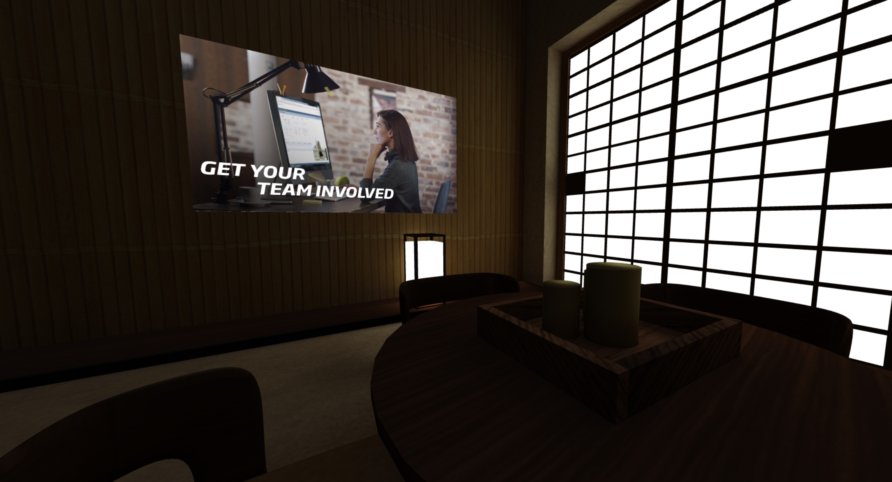

# Kaltura Virtual Reality Player
A proof of concept to demonstrate the [Kaltura Player](https://developer.kaltura.com/player/web/getting-started-web) inside of WebVR player using the https://a-frame.io/ VR framework. 

## Demo:

[Click here for demo](https://kaltura-vpaas.github.io/webvr-kaltura-demo/readme-assets/twovid.html)


## Requirements:

1. [Nodejs](https://nodejs.org/en/)
2. [Kaltura VPaaS account](https://corp.kaltura.com/video-paas/registration?utm_campaign=Meetabout&utm_medium=affiliates&utm_source=GitHub)

## Getting Started:

1. Copy env.template to .env and fill in your information as per its instructions.
2. Run: npm install
3. Run: npm start
4. Navigate to http://localhost:3000

# Examples:

###  Proof of Concept

[Proof of concept demo](https://kaltura-vpaas.github.io/webvr-kaltura-demo/readme-assets/poc.html) 


| [Source Code](https://github.com/kaltura-vpaas/webvr-kaltura-demo/blob/master/views/proof-of-concept.ejs) | [Video Walkthrough](http://www.kaltura.com/tiny/xr9zl) |
| :----------------------------------------------------------: | :----------------------------------------------------: |

This is the bare minimum of code to run a Kaltura player inside of an a-frame WebVR scene. 

First the Kaltura Player code is retrieved for your account: 

```ejs
<script src="https://cdnapisec.kaltura.com/p/<%=process.env.PARTNER_ID%>/embedPlaykitJs/uiconf_id/<%=process.env.PLAYER_ID%>"></script> 
```

Next, take a look at the body:

```html
<body>
  <!-- Kaltura Player -->
  <div id="video-player" style="display: none"></div>

  <a-scene raycaster cursor="rayOrigin: mouse">
    <!-- some static objects -->
    <a-sky color="#BDC9C1"></a-sky>
    <a-plane position="0 0 -4" rotation="-90 0 0" width="4" height="4" color="#7BC8A4"></a-plane>
    <a-box position="-1 0.5 -3" rotation="0 45 0" color="#4CC3D9"></a-box>
    <a-sphere position="3 1.25 -5" radius="1.25" color="#EF2D5E"></a-sphere>

    <!-- The video box-->
    <a-box 3dvid position="0 2 -4" rotation="20 40 25" width="4" height="2" ></a-box>
  </a-scene>

</body>
```

First a div `video-player` is created to inject the Kaltura player into, but it is not actually displayed, this will be explained later.

Next, some static `a-frame` objects are created, these are not necessary, but show how the Kaltura player can be injected into a scene of any complexity or a simple one like this example. 

Finally, the `a-frame` object that will become the video player: 

```html
<a-box 3dvid position="0 2 -4" rotation="20 40 25" width="4" height="2" ></a-box>
```

This is a normal `a-frame` box object. However, notice the `3dvid` attribute. In a-frame terms this is a `name` used to identify this box.

Next, the box is registered with a-frame.

```javascript
AFRAME.registerComponent("3dvid", {
```

Notice the `3dvid` attribute declared in the html is used to identify and register the specific box component with `a-frame`

Next the Kaltura player is loaded as it would normally be in any context:

```javascript
         const config = {
            playback: {
              autoplay: true,
              allowMutedAutoPlay: true
            },
            log: { level: "DEBUG" },
            targetId: "video-player",
            provider: {
              partnerId: "<%=process.env.PARTNER_ID%>",
              uiConfId: "<%=process.env.PLAYER_ID%>"
            },
            text: {
              useNativeTextTrack: true
            }
          };
          player = KalturaPlayer.setup(config);
        } catch (e) {
          console.error(e.message);
        }

        player.loadMedia({ entryId: '<%=process.env.ENTRY_ID%>' });
```

Now, through a clever use of `three.js` and the `<canvas>` element each frame of the Kaltura video is captured, buffered through the canvas and drawn onto the `a-frame` box element:

```javascript
          // create threejs texture which is mapping canvas to texture
          videoTexture = new THREE.Texture(videoImage);
          videoTexture.minFilter = THREE.LinearFilter;
          videoTexture.magFilter = THREE.LinearFilter;

          // create material from texture
          var movieMaterial = new THREE.MeshBasicMaterial({
            map: videoTexture,
            side: THREE.DoubleSide,
          });

          // assign material to this object's mash
          this.el.getObject3D("mesh").material = movieMaterial;
```

The video is explicitly configured to auto-play on page load, covered above:

```javascript
            playback: {
              autoplay: true,
              allowMutedAutoPlay: true
            },
```

And due to browsers muting video that autoplays, an event listener is created to unmute the video when the user clicks anywhere:

```javascript
    document.addEventListener('click', function (evt) {
      player.muted = false;
    });
```


### Clickable Video

[Clickable Video Demo](https://kaltura-vpaas.github.io/webvr-kaltura-demo/readme-assets/video-click.html)


| [Source Code](https://github.com/kaltura-vpaas/webvr-kaltura-demo/blob/master/views/video-click.ejs) | [Video Walkthrough](http://www.kaltura.com/tiny/j7ay5) |
| :----------------------------------------------------------: | :----------------------------------------------------: |

In this example we create a user experience when a video object in the vr scene is clicked it will proceed to play the video in a 2d "normal" experience. A return button is created so the user can return to the 3d scene. 

in the html:

```html
  <!-- Kaltura Player -->
  <div id="video-player" style="display:none; aspect-ratio:16/9; max-height: 85vh; margin: auto;"></div>
  <div class="center">
    <div id="back2vr" style="display:none;">Return</div>
  </div>

  <a-scene id="mainscene" raycaster cursor="rayOrigin: mouse">
    <!-- The video box-->
    <a-box 3dvid id="vidbox"> </a-box>
  </a-scene>
```

and javascript:

```javascript
  <script type="text/javascript">
    var targetEl = document.querySelector('#vidbox');
    targetEl.addEventListener('click', function () {
        //hide aframe scene
        $("#mainscene").hide();
        //show video
        $("#video-player").show();
        //show return button
        $("#back2vr").show();
    });

    $("#back2vr").click(function () {
      $("#video-player").hide();
      $("#back2vr").hide();
      $("#mainscene").show();
    });
  </script>
```


### Multiple Clickable Video and Kaltura WebVR Framework

[Multiple Click Video Demo](https://kaltura-vpaas.github.io/webvr-kaltura-demo/readme-assets/video-click.html)


| [Source Code](https://github.com/kaltura-vpaas/webvr-kaltura-demo/blob/master/views/twovideo.ejs) | [Video Walkthrough](http://www.kaltura.com/tiny/ulgfj) |
| :----------------------------------------------------------: | :----------------------------------------------------: |

The single click example was a building block, but it does not scale to multiple videos. In order to handle multiple videos all of the code built thus far needs to be encapsulated so that it can be reused for multiple videos. So [kaltura-aframe.js](https://github.com/kaltura-vpaas/webvr-kaltura-demo/blob/master/public/kaltura-aframe.js) was created: 

```javascript
function loadKalturaWebVR(boxName, videoSource, entryId, partnerId, playerId, ks) {
    AFRAME.registerComponent(boxName, {
        schema: {
```

All the variables have been parameterized. Take note of variable scope. In the previous examples, the `player` was declared at global scope, however in [kaltura-aframe.js](https://github.com/kaltura-vpaas/webvr-kaltura-demo/blob/master/public/kaltura-aframe.js) variables are scoped to the special javascript reserved keyword `this`

```javascript
this.player = KalturaPlayer.setup(config);
```

Keep in mind the context of `this` is inside of the [AFRAME framework's prototype](https://aframe.io/docs/1.2.0/core/component.html#component-prototype-properties).

The Kaltura `player` is created inside of a-frame's init [lifecycle](https://aframe.io/docs/1.2.0/core/component.html#definition-lifecycle-handler-methods) method and stored in `this`:

```javascript
           init: function () {
               ...
               this.player = KalturaPlayer.setup(config);
```

 and then is later accessed in the `tick` lifecycle method, again via `this`

```javascript
           tick: function () {
               ...
               if (!this.player.paused
```

This is a very important pattern, and it used again to achieve the video click behavior for multiple videos:

[initVidClick](https://github.com/kaltura-vpaas/webvr-kaltura-demo/blob/master/public/kaltura-aframe.js#L102) has been refactored to access the different players:

```javascript
function initVidClick(boxDomId, videoSource, boxComponent) {
    var targetEl = document.querySelector("#" + boxDomId);
    //player instance is actually stored in the aframe element
    var player = targetEl.components[boxComponent].player;

```

Each `<a-box>` has a kaltura player stored in it, and it is retrieved here using the [component keyword](https://aframe.io/docs/1.2.0/core/component.html#accessing-a-component%E2%80%99s-members-and-methods) from a-frame. Since there are multiple videos, the user experience must account for how to best play the audio of each video. Now that a handle to each player is available, simply call `player.muted` when the video is clicked

```javascript
    targetEl.addEventListener('click', function () {
        //hide aframe scene
        $("#mainscene").hide();
        //show video
        $("#" + videoSource).show();
        //show return button
        $("#back2vr").show();
        //unmute player
        player.muted = false;
    });
```

and unmute when returning the user to the vr scene:

```javascript
    $("#back2vr").click(function () {
        $("#" + videoSource).hide();
        $("#back2vr").hide();
        $("#mainscene").show();
        player.muted = true;
    });
```

As this example demonstrates, the a-frame framework provides a very robust API that allows for the creation of flexible and sophisticated user experiences. 

### Captions Example

[Captions Demo](https://kaltura-vpaas.github.io/webvr-kaltura-demo/readme-assets/captions.html)


| [Source Code](https://github.com/kaltura-vpaas/webvr-kaltura-demo/blob/master/views/captions.ejs) | [Video Walkthrough](http://www.kaltura.com/tiny/t7oal) |
| :----------------------------------------------------------: | :----------------------------------------------------: |

Normally, the Kaltura player handles captions out of the box at the [API](https://developer.kaltura.com/workflows/Enrich_and_Organize_Metadata) level and also simply through the [KMC](https://kmc.kaltura.com/index.php/kmcng/login)

However, in the context of this WebVR example, some extra work must be done to make captions work. 

The captions example builds off the proof of concept example above.

First, the captions must be explicitly loaded into the player: 

```javascript
        //Load media and external text track
        player.setMedia({
          sources: {
            captions: [
              {
                url: "en.srt",
                label: "English",
                language: "en",
                default: true
              }, {
                url: "fr.srt",
                label: "French",
                language: "fr",
                default: true
              },
            ]
          }
        });
```

These srt files are included in this example and served locally. 

Some extra configuration is needed to load the default captions. This could be altered to auto-detect the default system language via javascript `navigator.language` 

```javascript
        //Select the default track when tracks are loaded
        player.addEventListener(player.Event.TRACKS_CHANGED, () => {
          let languageTrack = player.getTracks("TEXT").find(track => track.language === "en");
          player.selectTrack(languageTrack);

          // set track id based on langauge
          let textTracks = player.getVideoElement().textTracks;
          console.log("textTracks", textTracks);
          var languageToShow = "playkit-external-track";
          for (let i = 0, len = textTracks.length; i < len; i++) {
            console.log("language", textTracks[i].language);
            if (textTracks[i].language == languageToShow) {
              console.log("track to show", i);
              trackToShow = i;
            }
          }
        });
```

Finally, through some math, the text is drawn in the correct location:

```javascript
            //videoImageContext.font = `${fontSize}px Arial`;
            // measures how wide the text is going to be in pixels
            var textWidth = videoImageContext.measureText(text).width;

            //will draw and 50% transparent white box behind the text to make the text better visible
            videoImageContext.fillStyle = "rgba(255, 255, 255, 0.5)";
            videoImageContext.fillRect(
              1280 / 2 - (textWidth * marginTextBoxOffset) / 2,
              (720 / 8) * 7 - (fontSize * marginTextBoxOffset) / 2,
              textWidth * marginTextBoxOffset,
              fontSize * marginTextBoxOffset
            );

            // draw text
            videoImageContext.fillStyle = "black";
            videoImageContext.fillText(text, 1280 / 2, (720 / 8) * 7);
```


### Blender WebVR Example:

[Blender demo](https://kaltura-vpaas.github.io/webvr-kaltura-demo/readme-assets/blender-example.html)



| [Source Code](https://github.com/kaltura-vpaas/webvr-kaltura-demo/blob/master/views/blender-example.ejs) | [Video Walkthrough](http://www.kaltura.com/tiny/s5kj8) |
| :----------------------------------------------------------: | :----------------------------------------------------: |

Most 3d scenes are created in 3d creation application like the popular free and open source [Blender](https://www.blender.org/) or [Unity](https://unity.com/)

In this example, Blender was used to create a scene that integrates the video player from the above examples into a more real-world use case. Note, this example is only a proof of concept not incorporating best practices or fully rendering the scene, hopefully it serves as a building block for the kinds of rich vr experiences possible in the realm of VR. 

#### Setup

1. Install Blender:  [Blender](https://www.blender.org/)
2. Install the Blender a-frame exporter: https://github.com/silverslade/a-frame_blender_exporter

A free, opensource ready-made scene was downloaded from https://sketchfab.com/feed (you'll want to install the importer plugin for Blender)

In the scene, a placeholder cube was created in the same dimensions (16:9) as the video and placed exactly where the video will appear in the final scene. 


Once you are satisfied with you scene, use the a-frame exporter to export an a-frame scene:

#  

In the `index.html` produced by the a-frame exporter,  find the cube asset you created as a placeholder, and change it to an `a-frame` box. You will have to experiment with dimensions of the box between `height`, `width` and `depth` , but the position will be correct:

```html
 <a-box test height="7.2" depth="12.8" position="-13.982090950012207 8.457517623901367 2.251915454864502"
      visible="true" shadow="cast: false"></a-box>
```

As you see above, the `test` identifier was given to the box, and the same `a-frame` registration code was used to initialize this box and make it a playing video. 

### Another option for Kaltura WebVR: Brand3d

[Brand3d](https://brand3d.com/), a Kaltura partner, has sophisticated and well designed tools for working with 3d objects. You may also want to consider learning about: https://knowledge.kaltura.com/help/create-and-edit-content-using-the-3d-creator-tool

# Contributing

Thank you for helping Kaltura grow! If you'd like to contribute please follow these steps:

* Use the repository issues tracker to report bugs or feature requests
* Read [Contributing Code to the Kaltura Platform](https://github.com/kaltura/platform-install-packages/blob/master/doc/Contributing-to-the-Kaltura-Platform.md)
* Sign the [Kaltura Contributor License Agreement](https://agentcontribs.kaltura.org/)

# Where to get help
* Join the [Kaltura Community Forums](https://forum.kaltura.org/) to ask questions or start discussions
* Read the [Code of conduct](https://forum.kaltura.org/faq) and be patient and respectful

# Get in touch
You can learn more about Kaltura and start a free trial at: http://corp.kaltura.com    
Contact us via Twitter [@Kaltura](https://twitter.com/Kaltura) or email: community@kaltura.com  
We'd love to hear from you!

# License and Copyright Information
All code in this project is released under the [AGPLv3 license](http://www.gnu.org/licenses/agpl-3.0.html) unless a different license for a particular library is specified in the applicable library path.   

Copyright © Kaltura Inc. All rights reserved.   
Authors and contributors: See [GitHub contributors list](https://github.com/kaltura/YOURREPONAME/graphs/contributors).  

### Open Source Libraries Used

https://a-frame.io/ 

https://threejs.org/

https://www.blender.org/

https://github.com/silverslade/a-frame_blender_exporter
